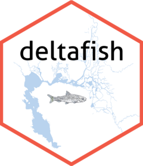

# deltafish <a href="https://delta-stewardship-council.github.io/deltafish/"></a>

Credit to [Brian Mahardja](https://github.com/bmahardja) for the Delta Smelt drawing in the logo. 

<!-- badges: start -->
[](https://github.com/Delta-Stewardship-Council/deltafish/actions/workflows/R-CMD-check.yaml)
[](https://app.codecov.io/gh/Delta-Stewardship-Council/deltafish?branch=main)
  [](https://sbashevkin.r-universe.dev/ui#package:deltafish)
  [](https://doi.org/10.5281/zenodo.6484439)
  [](https://portal.edirepository.org/nis/mapbrowse?scope=edi&identifier=1075)
<!-- badges: end -->

The goal of `deltafish` is to provide easy access to the [integrated San Fransisco estuary Delta fish dataset](https://portal.edirepository.org/nis/mapbrowse?scope=edi&identifier=1075&revision=1). This dataset is published, citeable, and documented on [EDI](https://portal.edirepository.org/nis/mapbrowse?scope=edi&identifier=1075&revision=1). The dataset contains around 45 million rows, which are not easily queryable with normal R techniques. `deltafish` utilizes [RSQLite](https://rsqlite.r-dbi.org/articles/RSQLite.html), along with `dbplyr` to make the process of working with this large dataset much easier on a standard computer. 

You can use `dplyr` verbs to query the database in much the same way as you would a `data.frame`. Instead of computing your function return value every time you execute a `dplyr` function call, however, `dbplyr` builds a query on the backend which is only run when you `collect_data()` the data. This means you execute far fewer queries and are able to work with the data much more efficiently. 

We recommend you use the `collect_data()` function from this package instead of the `collect()` function from `dplyr` because `collect_data()` will convert the Date and Datetime columns in your dataset, if present, into the appropriate format with the appropriate time zone. This is necessary because SQLite does not have a data format for dates and datetimes. Instead, those columns are stored as text. SQLite can still perform some operations on them (e.g., you can filter based on date as in the example below), but they remained stored as text instead of date and datetime formats. 

Unless you are familiar with SQLite, you may want to only perform simple operations such as `filter`, `select`, and `join` before you `collect_data()` and then can run any R operation on the dataset. You can perform more complex operations like `mutate` and `summarise` but some R expressions cannot be translated to SQLite and will return an error. If you are familiar with SQLite, you can alternatively interact with the database using SQLite queries through the `RSQLite` package. 

To begin, install the package as below and run `create_fish_db()`. This will download the data and create the arrow dataset.

## Installation

You can install the package via github:
``` r
devtools::install_github("Delta-Stewardship-Council/deltafish")
```

Or via r-universe:

``` r
# Enable this universe
options(repos = c(
    sbashevkin = 'https://sbashevkin.r-universe.dev',
    CRAN = 'https://cloud.r-project.org'))

# Install the package
install.packages('deltafish')
```

## Example

First build the database. This takes a bit to run since the source data are large.

``` r
library(deltafish)
create_fish_db()
```

Then open and query data. You have to first open a connection to the database with `open_database()`

```r
# dplyr required for queries below
library(dplyr)
library(deltafish)

con <- open_database()

# open our two data tables
surv <- open_survey(con)
fish <- open_fish(con)

# filter for sources and taxa of interest
# Also filter for dates of interest. Although dates and datetimes are stored as text in the dataset,
# you can still filter on them using text strings in the "YYYY-MM-DD" or "YYYY-MM-DD HH:MM:SS" format.

surv_FMWT <- surv %>% 
    filter(Source == "FMWT" & Date > "1999-01-01") %>% 
    select(SampleID, Date)

fish_smelt <- fish %>% 
    filter(Taxa %in% c("Dorosoma petenense", "Morone saxatilis", "Spirinchus thaleichthys"))


# do a join and collect_data the resulting data frame
# collect_data executes the sql query, converts Date and Datetime columns to the correct format and timezone, and gives you a table
df <- left_join(surv_FMWT, fish_smelt) %>% 
    collect_data() 
# close connection to database
close_database(con)

```

## Data updating and versioning

When the integrated dataset is updated, you do not necessarily need to update your installation of the `deltafish` package, although you will need to use a version equal to or greater than 1 to work with the data publication version 2 or later. You can access the latest data by re-building the cached database via 

``` r
library(deltafish)
create_fish_db(update=TRUE)
```

Or, you can specify the exact version of the data package you wish to use. This enables reproducibility by ensuring the correct data package version is used. 

``` r
library(deltafish)
create_fish_db(edi_pid="edi.1075.1")
```

To create a fully reproducible workflow, you should also note the `deltafish` package version used, which could always be installed later with e.g.,

``` r
devtools::install_github("Delta-Stewardship-Council/deltafish", ref="v0.2.0")
```
